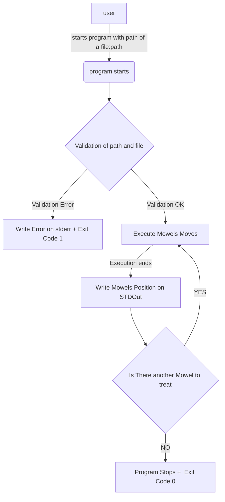

# Auto-Mower Program

## Practical Infos  

- Author: BVO  
- Created on : 21/03/2022
- Last Update : 21/03/2022
- V.0.0.1 

## Intro 

### overview
The company X wants to develop an automower for square surfaces.

A basic [expression of needs](/0_NEEDS_ANALYSIS.md) is provided.
### summary of the needs 

- company X needs a program wich : 
  - takes in input, a file containing :
    - a map, representing a lawn (simplified as a square, and given by the dimensions of the square)
    - a list of mowers associated to : 
      - inital coordinates/orientations of several mowers.
      - a list of instructions of movement to execute
  - simulates the moves of the mowels:
    - movements must be executed in order its provided
    - movements of each mowels are done at the moment the previous mowell fully performed it's movments  
  - gives as output, a text containing: 
    - a final mowers coordinates/orientations, when it finishes.

### Perimeter  
there are not enough informations ( and time ) to actually integrate a program but enough to design a demonstrator. 

It Will be provided a basic programm to run several automowers on square surfaces.
- the program will fit the needs, and may simulate what is not provided ( ex : the trnasmission of instructions to mowers ) 
- the program will provide an architecture able to evolve from a demonstrator to a V1 program. 
- Not enough to actually integrate a program but enough to design a demonstrator. 

It may be choosen some functional limits more like  size of the lawn, typing datas... but not such a collide management   
It may be added some technical requirements witch are not expressed in functionnal needs, such as a dumb error management,  the platform availibility, a verbose mode, logs.  

We won't provide any integration solution, but a user manual to run the project and modify it.

### Solution  

#### Console App choice 

regarding the needs and the purpose of the program, a *console app* seems to be an accepatable choice. 
- there is no need of simultaneousity of treatment of several files
- no needs of immediate or parmanent availaibility 
- the only needs is to show the treatment of a file  
- it fits with the needs to use a file in entry and give text in output ( in this case it can be the basic std output ) 
- An API would have been another solution, since we can upload a file in post method but with a good architecture witch separate business from front exposal it can be switched  easily in the future

#### Basic functionment 

##### Choices 

Techno :  *.NET 6* 
- durability : it is the LTS of .NET CORE framework. support available < 2029
- perf : the performances are in accordance with the needs
- constraint format : different formats of programms,  especialy  Console App and APIS
- interoperability : It runs on several OS and can be dockerized
- developpers skills: The Team ( me  ... ) has some skills in .NET but can't develop in .NET for years so it's a good time to practice. 

##### Architecture 

The need is very basic, we can imagine an app in two layers but that can stay evolutive

- the business layer will be on chargez to manage Lawns, Mowers, and Mowers Movements, and Their associated business rules
  - recording of lawns and validation of lawn size
  - recording of mowers and validation of inital position 
  - Execute mower commands according to ruls furnished in the needs     
- the front layer will takes in charge rules specific to the requirements of the programs:  
  - the parsing of the files
  - the parsing of command arguments ( path of the files and maybe other options )  
  - the algorithm to run mowers in order 
  - the output format   

This architecture is evolutive because :
- if Lawns evolves / Mowers evolves : 
  - Lawns/Mowers 1must now be stocked in database or furnished in api, it can be easily add a DAL.Lawn 
  - ... 
- if Mowers need to be controled / programmed from multiple devices. Depending on the Wish But business and front layers can be exposed as APIS ...  

#### No Docker / No Api  

in order to stay simple, since there is no need of availability the simpler and faster is to develop only one Program. 
It Is very tempting to do an API at least to expose business, it would isolate in a specic program the front layer rules witch are very specific and not very reusable.

### QA 

#### TU / TI / Logs 
- At least the program must have an excellent code coverage wit unit tests. 
- Since the contract is really simple and  there is no real integration, no integration tests will be developped for now 
- Logs in order to enhance debugging and development the program will be able to log in console

#### Monitoring / Alerting / Perf
- In this context there are no such needs.  
- If the business becomes an API as mentioned below, it would be interesting to bench Load and Perf.  

####
some use cases are in ../Examples.  
